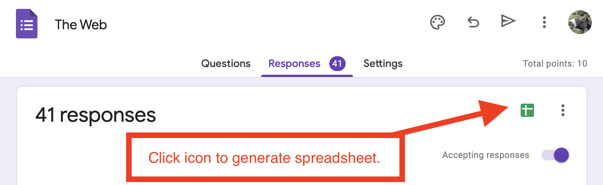
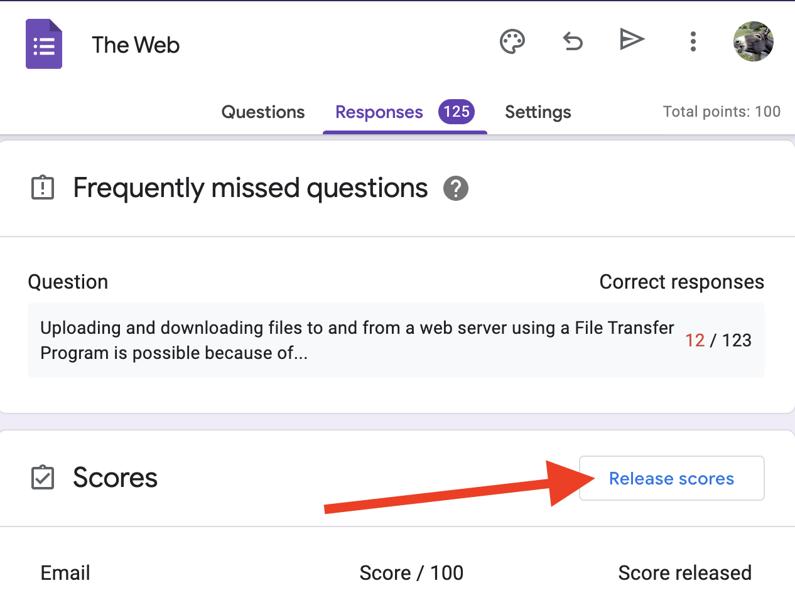
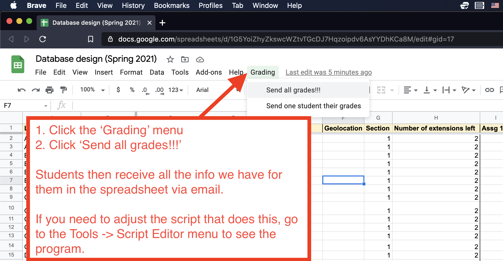

# Automated Grading

The Web Design course is designed to include automation of many mundane aspects of grading and administration in order to allow more focus on human elements of teaching and grading.

## Quizzes

Quizes are issued to students as [Google Forms](https://forms.google.com). Submissions are automatically graded against an answer key entered into the form's administrator interface.

The Google Forms admin interface contains a `Responses` tab, where student submissions are visible. This page also shows an icon that can be clicked to generate a Google Sheet showing each student's time of submission and score.

### Usage

1. Translate all scores to integers between 0 and 100, and enter them into the main course gradebook.

1. Once an assignment is past due and late quiz submissions are no longer accepted, click the button to `Release` scores from within the Google Form `Responses` page - this sends students an email containing their score and a link to view the answer key of the Quiz.
   

## Assignments

Assignments are issued to students as GitHub repositories using [GitHub Classroom](https://classroom.github.com). Each student receives a copy of a code repository containing instructions and any relevant starter code.

There are `tests` directories in most assignments. These includes Python-based unit testing code that automatically analyzes students’ web sites to determine whether they satisfy the requirements of the assignment. These automated tests pop open a [headless web browser](https://en.wikipedia.org/wiki/Headless_browser), load a student's web site in the browser, and looks for the components of the web site required by the assignment.

### Usage

To use these automated tests, do the following:

1. Download the appropriate version of [Webdriver for Chrome](https://sites.google.com/chromium.org/driver/downloads) for your operating system and your version of Chrome.

1. Move the executable file you download to a directory that is already included in your system’s `PATH` variable. You can see which directories are on your system’s `PATH` by opening up a command line window (i.e. Terminal on Mac or `cmd` on Windows) and typing `echo $PATH` (Mac) or `echo %PATH%` (Windows). Mac users can most likely safely place the file into `/usr/local/bin`. Windows users can probably place it into `C:\Windows\system32`

1. Install [Python](https://www.python.org/downloads/) if you don’t already have it, and then install [pytest](https://docs.pytest.org/en/6.2.x/getting-started.html). You can install `pytest` from the command line by running `pip install -U pytest`.

1. Open a student's repository in [Visual Studio Code](https://code.visualstudio.com), open the integrated Terminal within VSCode, and run the command, `pytest`. This should show you how many tests passed and how many failed.

1. Develop a rubric for each assignment that determines how many points each test should be worth, and subtract points for any tests that fail. All assignments are graded from 0 - 100 and all tests should be equally weighted. Take off points for any lateness, as per the course late work policy - the commit history of any repository on GitHub shows the date and time of each submission.

1. Once this automatic analysis of student web sites works on your machine, focus your human efforts on looking over students' code and giving useful feedback and criticism. Take off some points for stylistic code problems like poor indentation of code, inconsistent capitalization, and other sloppy practices discussed in the course, even if the code works functionally.

1. Leave short but clear helpful comments for every assignment in the main course gradebook. Explain in human terms why each student lost any points. There is no need to refer the tests in these comments - explain concisely in human terms the problems identified in the code either by the automated tests or by yourself.

### Batch assignment grading

A [separate project](https://github.com/nyu-python-programming/assignment-autograder-and-exam-timer) contains tools for automatically calculating grades for all submissions to a particular assignment based on the number of automated tests that pass. That repository also contains a tool to check how much time each student took to complete the work, which can be useful for giving late penalties.

## Main Gradebook

The main course gradebook is a Google Sheet. This spreadsheet contains a script that will send students an email containing all their grades when run.

## Usage

- Students should be sent their grades from the gradebook whenever grading has been completed for any work.

- To do so, in the Google Sheet gradebook, click on the `Grading` menu, and then click `Send all grades!!!`.

- The first time this menu is clicked, the Google Sheet will ask you to authorize it. Once authorized, you will have to click the option to `Send all grades now!!!` again a second time to complete the task. In subsequent times, you only have to click the menu once.

- If you need to send grades to just a single student, for example if a grade adjustment has been made just for that student, click the `Send one student their grades` option. Enter the row number of the student in question into the dialog that then pops up, and click the button to send.

