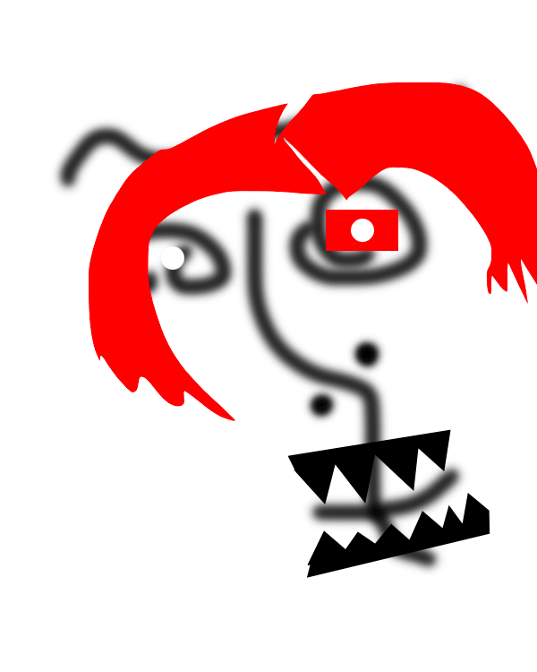
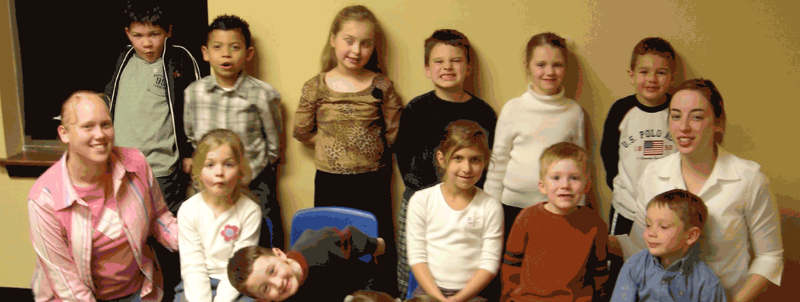

# Animated GIFs

Examples of animated GIF images, created with Photoshop, focusing on:

- Frame-based animation
- Position changes in each frame
- Visibility changes in each frame
- Tweens (automatically creating in-between frames) between key frames
- The culture of animated GIFs

## Image files

### Example 1

[NFT](https://en.wikipedia.org/wiki/Non-fungible_token)-style animated face

- [The layered source file](./nft_winner.psd) is available for editing in Photoshop `.psd` format.
- The flat (layerless) and compressed animated `.gif` file is ready for posting to the web:
- inspired by [Siphon #12/20](https://opensea.io/assets/0x905e7e152ecd7315f03d8d671578ea72684cca99/33500010012) by [XCOPY](https://opensea.io/collection/xcopy).

### Example 2

Class photo with floating heads:

- [The layered source file](./class.psd) is available for editing in Photoshop `.psd` format.
- The flat (layerless) and compressed animated `.gif` file is ready for posting to the web:
- credits: [Amber's class](https://flickr.com/photos/garrette/12869462/in/photolist-28XDh-M2aLo-2k3d6R5-2hzCa5u-8R7vk-2hCg3Vi-724XnU-2ghtaqm-AdGbVg-724WV5-2gnR1jR-31mRYZ-7z2gzm-Czc4uP-5eHWfo-aAitv4-aAipLV-4eHVtW-aAm9n7-aAirHt-aAioRi-6bQi2J-hMpiP-ebEWUf-bK38Gp-BTyUeD-8G4ZF2-8q9dAB-2jx7WPq-G1gXQ-2eqzT7c-6M5v1p-6xM9zY-GUsXeK-2hCYNCB-cz6cEY-QZmrB2-2kYVqoy-2j4RoQc-2j8A2ta-2AN7Ke-8r8cmm-gvmi7h-pYdXLM-7aN9rG-pu9G-9KeAg9-iPXD5-7kifJY-6m7tcf) photo by [Garette](https://flickr.com/photos/garrette/), shared under the [Attribution 2.0 Generic](https://creativecommons.org/licenses/by/2.0/) license.

