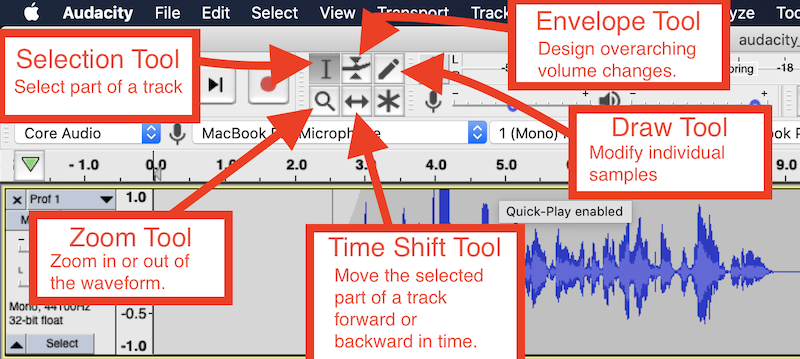
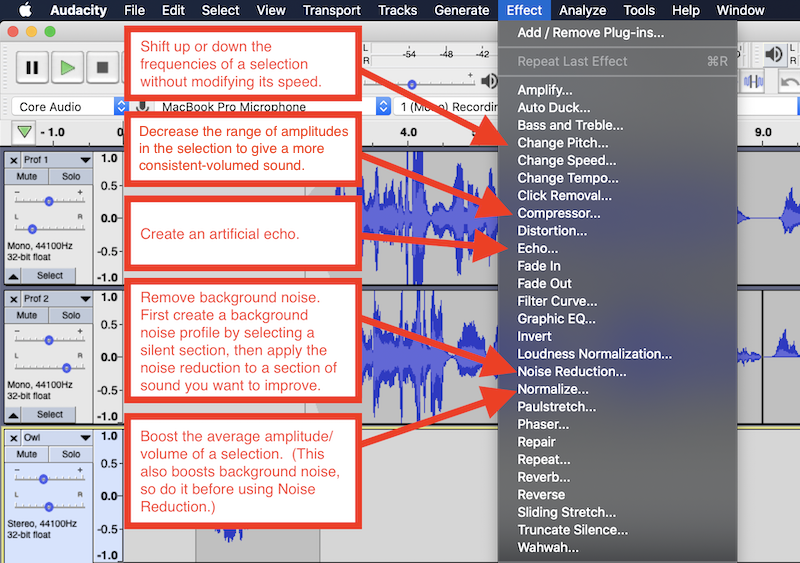

# Digital Audio With Audacity

Example of using Audacity to produce multi-track audio. Key concepts include:

- Recording audio tracks from a microphone.
- Importing sound effect files into tracks.
- Using the Selection tool to edit parts of the audio.
- Using the Zoom tool to zoom in or out (click while holding the `Shift` key).
- Using the Time Shift tool to move selected parts of the audio forward or backward in time.
- Using the Envelope tool to create smooth volume shifts to tracks.
- Reducing background noise with the Noise Reduction effect.
- Evening sound levels with the Normalization effect.
- Other effects, including Distortion, Echo, and Pitch Shift.
- Export to MP3 using the bundled [LAME MP3 encoder](https://lame.sourceforge.io/).

## Interface

Where to find the Tools in Audacity:

Where to find the Effects in Audacity:

## Example

- The exported stereo (two-track) compressed [`.mp3` file](./audacity_example.mp3) is ready for posting to the web.
- [The multi-track source file](./audacity_example.aup) is available for editing in Audacity `.aup` format.

## Credits

The audio file contains audio samples from the following works:

- [Owl hoot](https://freesound.org/people/Breviceps/sounds/465697/), by [Breviceps](https://freesound.org/people/Breviceps/), shared under the [Creative Commons Universal Public Domain Dedication](https://creativecommons.org/publicdomain/zero/1.0/).
- [Cymbal](https://freesound.org/people/altemark/sounds/207956/), by [altemark](https://freesound.org/people/altemark/), shared under the [Creative Commons Attribution 3.0 Unported](https://creativecommons.org/licenses/by/3.0/) license.
- [Drum Roll](https://freesound.org/people/MissloonerVoiceOver255/sounds/567125/), by [MissloonerVoiceOver255](https://freesound.org/people/MissloonerVoiceOver255/), shared under the [Creative Commons Universal Public Domain Dedication](https://creativecommons.org/publicdomain/zero/1.0/).
- [Snare Drum, Single Hit, A](https://freesound.org/people/InspectorJ/sounds/410514/), by [InspectorJ](https://freesound.org/people/InspectorJ/), shared under the [Creative Commons Attribution 3.0 Unported](https://creativecommons.org/licenses/by/3.0/) license.
